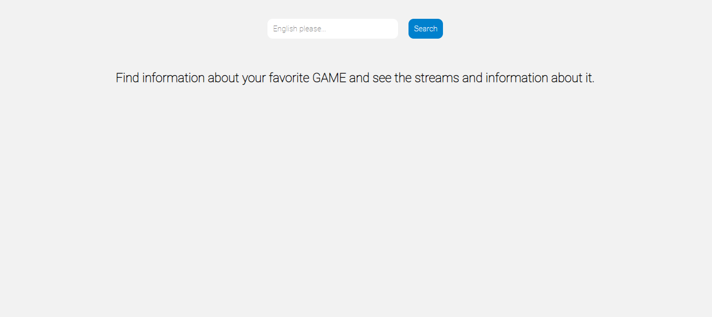
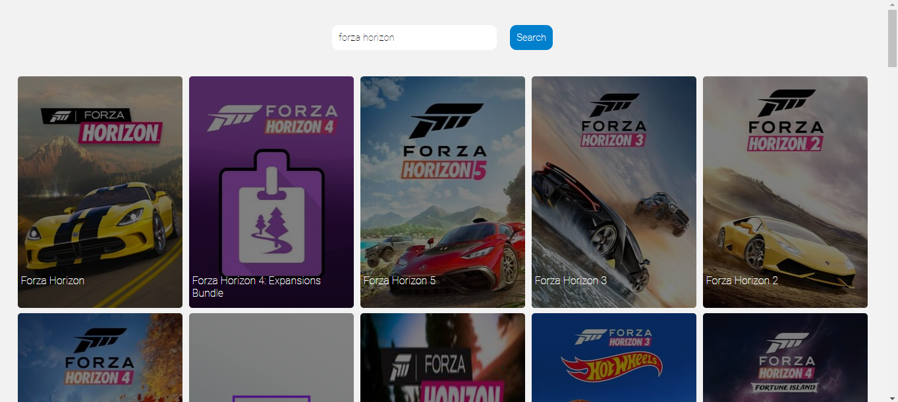
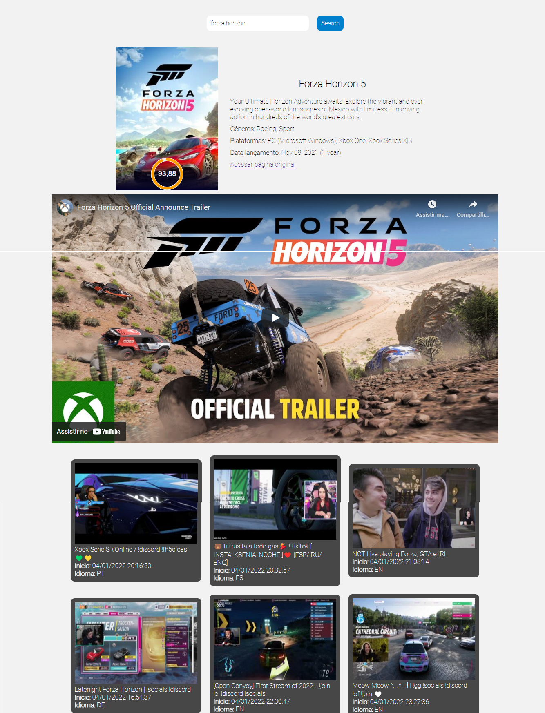

# Sobre Games

Webservice que consume as APIs do <a href="https://developers.google.com/youtube/v3" target="_blank">YouTube</a>, <a href="https://api-docs.igdb.com/#about" target="_blank">IGDB</a> e <a href="https://dev.twitch.tv/docs/api/" target="_blank">Twitch</a>.

A API IGDB retorna várias informações, mas usarei para pesquisar e obter as informações sobre um jogo.

A API do Twitch também retorna varias informações, mas usarei somente informações de lives.

A API do YouTube irá ser usada para retornar o trailer do jogo.

Foi feito uma API para tratar as informações retornadas pelas três APIs acima.

API url = https://twitch-game-app.herokuapp.com/

Front-end url = https://trabalho-webservices.vercel.app

# Como usar

1. Baixe o repositório e descompacte.

2. Adicione as suas chaves de acessos no arquivo ```.env```, use o arquivo ```.env.example``` como base.

3. Para executar a API, primeiramente execute ```pip install requirements.txt``` e depois ```python api/api.py```.

4. Para executar o FRONTEND vá na pasta ```frontend``` e abra o arquivo ```index.html``` no navegador.

# Prints






# Vídeo de apresentação

[![Watch the video]](.statics/video.mp4)
